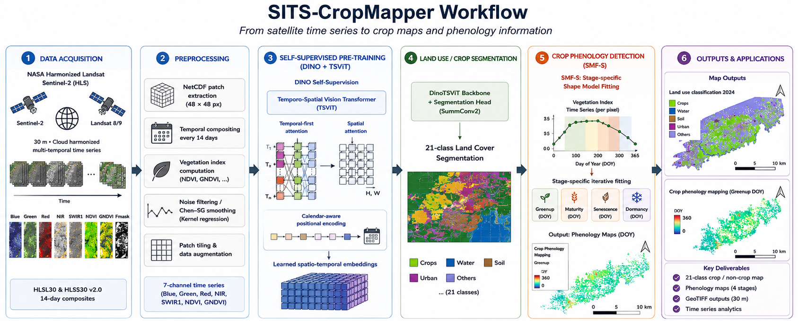

# SITS-CropMapper

Self-supervised crop segmentation and phenology detection from multi-temporal satellite imagery.

The system combines a **Temporo-Spatial Vision Transformer (TSViT)** pre-trained with **DINO** self-supervision on HLS (Harmonized Landsat Sentinel-2) time series, followed by a supervised segmentation head and an **SMF-S** phenological detector.

| Stage | Method | Output |
|---|---|---|
| Pre-training | DINO self-supervised on unlabelled HLS patches | Transferable backbone weights |
| Segmentation | TSViT + fine-tuned segmentation head | 21-class land-cover map |
| Phenology | SMF-S curve fitting on EVI time series | Greenup / Maturity / Senescence / Dormancy DOY |




---

## Repository structure

```
SITS-CropMapper/
│
├── run_cropmapper.py          # Unified CLI: download | pretrain | finetune | infer
├── run_hnd_pretrain.py        # Honduras pipeline: random tile download + GPU training
│
├── configs/
│   ├── default.yaml           # Default model/training config
│   └── hnd_pretrain.yaml      # GPU server config (patch_size=2, dim=256)
│
├── models/TSViT/
│   ├── TSViTdense.py          # Clean TSViT backbone (366-dim DOY encoding)
│   └── module.py              # Attention, PreNorm, FeedForward blocks
│
├── training/
│   ├── dino_pretrain.py       # DINO trainer (EMA teacher, multi-crop, AMP, resume)
│   └── finetune_segmentation.py  # Supervised fine-tuning with masked cross-entropy
│
├── datasets/
│   ├── hls_loader.py          # HLSPatchDataset: reads NetCDF patches, 14-day grid
│   ├── agro_satdata.py        # MltTileData: legacy multi-tile reader (random windows)
│   ├── dataloaders.py         # Legacy DINO dataloaders
│   └── transforms/            # Spectral jitter, DINO multi-crop augmentation
│
├── utils/
│   ├── hls_download.py        # HLS download: earthaccess, cloud masking, patch tiling
│   ├── gis_funs.py            # Spatial utilities
│   └── general.py             # Vegetation index formulas
│
├── detection/                 # Legacy inference engines (STViTS_detector, SMF-S)
│   ├── detectors.py
│   ├── smf_s_class.py
│   └── utils.py
│
├── demo_pipeline.py           # Legacy end-to-end demo (download → segment → phenology)
└── requirements.txt
```

---

## Installation

### Prerequisites

- Python 3.10+
- CUDA GPU recommended for training (CPU works for inference and smoke tests)
- [NASA Earthdata account](https://urs.earthdata.nasa.gov/users/new) for HLS download

### Conda environment

```bash
# Linux
conda create --name sits python=3.10 -y
conda activate sits

# Windows — if C: is full, redirect conda cache to another drive first
set TEMP=E:\tmp
set TMP=E:\tmp
conda config --add pkgs_dirs "E:\conda_pkgs"
conda create --prefix "E:\sits" python=3.10 -y
conda activate "E:\sits"
```

### Python dependencies

```bash
pip install -r requirements.txt

# PyTorch — pick the command matching your CUDA version
pip install torch torchvision --index-url https://download.pytorch.org/whl/cu121   # CUDA 12.1
pip install torch torchvision --index-url https://download.pytorch.org/whl/cu118   # CUDA 11.8
pip install torch torchvision --index-url https://download.pytorch.org/whl/cpu     # CPU only
```

### NASA Earthdata credentials

Create `~/.netrc` (Linux/Mac) or `%USERPROFILE%\.netrc` (Windows):

```
machine urs.earthdata.nasa.gov login YOUR_USERNAME password YOUR_PASSWORD
```

---

## Data

### HLS source

| Product | Sensor | Bands used |
|---|---|---|
| HLSS30 v2.0 | Sentinel-2 MSI | B02, B03, B04, B8A, B11, Fmask |
| HLSL30 v2.0 | Landsat 8/9 OLI | B02, B03, B04, B05, B06, Fmask |

Resolution: 30 m · revisit: ~2–3 days (merged) · harmonized to a 14-day composite grid.

### Patch format (NetCDF)

Each patch file covers a 48 × 48 pixel area:

- **Dimensions:** `date`, `y`, `x`
- **Variables:** `blue`, `green`, `red`, `nir`, `swir1`, `ndvi`, `gndvi`
- **Values:** 0–1 float32 (surface reflectance, already scaled)
- **Naming:** `hls_patch_XXXXX.nc` (new pipeline) or `*_patch_XXXX.nc` (legacy)

---

## Quickstart

### 1. Download HLS patches for an area

```python
from utils.hls_download import download_hls

download_hls(
    bbox=(-87.65, 14.40, -87.62, 14.43),   # (min_lon, min_lat, max_lon, max_lat)
    start_date="2021-01-01",
    end_date="2023-12-31",
    output_path="data/my_patches",
    patch_size=48,
    strategy="netrc",
)
```

Or via CLI:

```bash
python run_cropmapper.py download \
    --bbox -87.5 13.5 -87.0 14.0 \
    --start 2021-01-01 --end 2023-12-31 \
    --output data/my_patches
```

### 2. DINO pre-training on downloaded patches

```bash
python run_cropmapper.py pretrain \
    --patch-dir data/my_patches \
    --output-dir runs/dino \
    --epochs 100
```

Or with the default config directly:

```python
from training.dino_pretrain import DINOTrainer
import yaml

with open("configs/default.yaml") as f:
    cfg = yaml.safe_load(f)

trainer = DINOTrainer(
    model_config=cfg["model"],
    patch_dir="data/my_patches",
    output_dir="runs/dino",
    epochs=100,
    batch_size=16,
    device="cuda",
)
trainer.train()
```

### 3. Supervised fine-tuning

Requires labelled patches (NetCDF with a `label` variable alongside the spectral bands):

```bash
python run_cropmapper.py finetune \
    --patch-dir data/labelled_patches \
    --output-dir runs/finetune \
    --backbone runs/dino/dino_final.pth \
    --epochs 50
```

### 4. Inference

```bash
python run_cropmapper.py infer \
    --patch-dir data/my_patches \
    --weights runs/finetune/tsviT_seg_ep0050_final.pth \
    --output-dir results/my_area \
    --end-date 2023-12-31
```

---

## Honduras GPU pipeline

`run_hnd_pretrain.py` automates large-scale pre-training across Honduras: it randomly samples tiles from the country grid, downloads each, and trains DINO on the full collection.

### Configuration (`configs/hnd_pretrain.yaml`)

Key GPU settings:

| Parameter | Value | Notes |
|---|---|---|
| `patch_size` | 2 | 576 spatial tokens (vs 2304 for patch_size=1) — fits on most GPUs |
| `dim` | 256 | Embedding dimension |
| `temporal_depth` | 4 | Temporal transformer layers |
| `spatial_depth` | 2 | Spatial transformer layers |
| `crop_batch_size` | 8 | Crops processed per forward pass (increase if VRAM allows) |
| `batch_size` | 16 | Samples per step |
| `epochs` | 200 | |

### Usage

```bash
# Full pipeline: download 50 random tiles + train 200 epochs
python run_hnd_pretrain.py

# Download only (idempotent — skips tiles already done)
python run_hnd_pretrain.py --stage download --n-tiles 50

# Train only, auto-resume from latest checkpoint
python run_hnd_pretrain.py --stage pretrain --resume

# Custom paths and tile count
python run_hnd_pretrain.py \
    --patch-dir E:\data\hnd_patches \
    --output-dir E:\runs\hnd_dino \
    --n-tiles 150 \
    --epochs 200 \
    --batch-size 16 \
    --workers 4
```

**How many tiles?**
- **50 tiles** — recommended start. Enough diversity, ~1–2 h download, fast iteration.
- **150 tiles** — serious pretraining covering all major biomes of Honduras.
- **300 tiles** — near-complete national coverage (336 total 0.25° cells in the country grid).

Checkpoints are saved every 10 epochs to `--output-dir`. Re-running with `--resume` auto-loads the latest one.

### Windows notes

- The script uses `if __name__ == "__main__"` so DataLoader workers (`--workers 4`) work correctly on Windows.
- Mixed precision (AMP) is enabled automatically when a CUDA device is detected.
- If training on a secondary drive, set the conda environment there (see Installation above).

---

## Scientific background

- **TSViT:** Tarasiou et al. (2023) *ViTs for SITS: Vision Transformers for Satellite Image Time Series.* CVPR.
  Temporal-first factorization: processes the full temporal sequence per pixel before attending spatially. Uses acquisition-date positional encodings (DOY one-hot → linear projection) rather than sequence-order encodings.

- **DINO:** Caron et al. (2021) *Emerging Properties in Self-Supervised Vision Transformers.* ICCV.
  Student–teacher EMA framework. Multi-crop augmentation with centering + sharpening. No labels required.

- **SMF-S:** Liu et al. (2022) *Detecting crop phenology from vegetation index time-series data by improved shape model fitting in each phenological stage.* Remote Sensing of Environment 277, 113098.
  Stage-specific iterative fitting of growth curves to EVI time series to detect Greenup, Maturity, Senescence, Dormancy DOY.

---

## Citation

```bibtex
@inproceedings{tarasiou2023vits,
  title={{ViTs for SITS}: Vision Transformers for Satellite Image Time Series},
  author={Tarasiou, Michail and Chavez, Erik and Zafeiriou, Stefanos},
  booktitle={CVPR},
  year={2023}
}

@article{liu2022detecting,
  title={Detecting crop phenology from vegetation index time-series data by improved
         shape model fitting in each phenological stage},
  author={Liu, Licong and Cao, Ruyin and Chen, Jin and Shen, Miaogen and
          Wang, Siqing and Zhou, Jie and He, Bingzhe},
  journal={Remote Sensing of Environment},
  volume={277},
  pages={113098},
  year={2022}
}
```

---

## License

Developed at CGIAR. Contact [andres.aguilar@cgiar.org](mailto:andres.aguilar@cgiar.org) for licensing.
